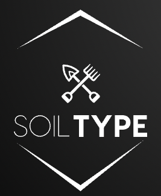

# SoilType
A R package to interplay shovelomics in quantitative genetics and precision agriculture.

# Install
devtools::install_github("rfn-qtl/SoilType")

# Load
library(SoilType)

# Vignettes
https://github.com/rfn-qtl/SoilType/blob/main/SoilType%20package%20Vignettes.R
